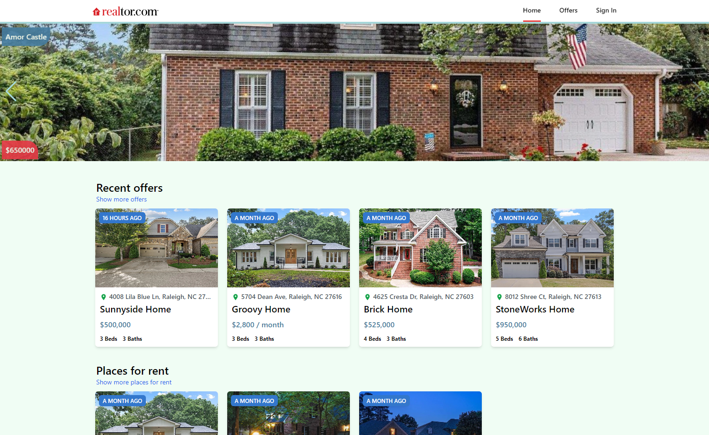

# Realtor

Welcome to Realtor a real estate website I developed using React.js, Firebase, Tailwind CSS, and React Router. 

## Screenshot 

## Features

- **Custom Categories:** Implementing custom categories allows users to easily navigate and filter listings based on their preferences.
- **Responsive Design:** The website I built is fully responsive, ensuring a seamless user experience across different devices and screen sizes.
- **Listing Cards:** I designed visually appealing listing cards to display essential information about each property, attracting potential buyers or renters.
- **Listing Pages:** Detailed listing pages provide comprehensive information about each property, including maps and image sliders, to enhance the user experience.
- **Firebase Authentication:** Utilizing Firebase auth, I integrated complete authentication functionality, including user sign-up, sign-in, and forgot password.
- **Google OAuth:** I incorporated Google OAuth to enable users to sign in using their Google accounts, ensuring a seamless authentication process.
- **Map Integration:** By utilizing the Leaflet package and Google Geolocation API, I added an interactive map displaying property locations.
- **Image Slider:** I enhanced the listing pages with a super amazing image slider using Swiper.js, allowing users to view property images effortlessly.
- **Customized Notifications:** I utilized the react-toastify package to create beautiful and customized notifications, providing informative feedback to users.
- **Loading Effects:** I implemented a beautiful spinner component for pages requiring loading effects, ensuring a polished user interface.
- **Private Routes:** I created private routes and custom hooks to protect important pages such as the user profile page, ensuring authorized access to sensitive information.
- **Tailwind CSS:** I mastered Tailwind CSS version 3 and used it to style the project, including the ability to add custom classes and achieve a visually appealing UI.

## Key Takeaways

- Gained proficiency in React.js, Firebase, Tailwind CSS, and other in-demand web development technologies.
- Learned how to build a professional real estate website, starting with project setup to deployment.
- Developed reusable components and followed best practices for file and folder organization, ensuring clean and maintainable code.
- Implemented CRUD operations and Firebase authentication, providing a fully functional real estate application.
- Enhanced the user experience through interactive features like maps, image sliders, and customized notifications.
- Utilized React hooks, events, and routing to build dynamic and responsive web pages.
- Acquired skills in styling and theming a project using Tailwind CSS, resulting in an appealing and modern UI.
- Explored techniques for protecting sensitive pages and implementing private routes, ensuring data security and authorized access.
- Gained insights into the latest versions of React.js, Firebase, Tailwind CSS, and React Router, keeping up with industry trends and best practices.

